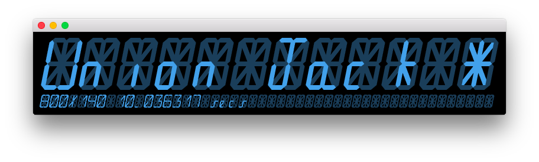

# UnionJack
CinderBlock for emmulating a 16-segment LED display using OpenGL.



## Installation

Download or check out this repoistory into your `Cinder/blocks` directory, then
use [Tinderbox](https://libcinder.org/docs/guides/tinderbox/) to create a new
project using UnionJack.

## Example

```c++
#include "cinder/app/App.h"
#include "cinder/app/RendererGl.h"
#include "cinder/gl/gl.h"
#include "UnionJack.h"

using namespace ci;
using namespace ci::app;
using namespace std;

class CinderProjectApp : public App {
  public:
    void setup() override;
    void update() override;
    void draw() override;

    UnionJack mDisplay1;
    UnionJack mDisplay2;
};

void CinderProjectApp::setup()
{
    Color light = Color8u::hex(0x42a1eb);
    Color dark = Color8u::hex(0x1a3e5a);

    mDisplay1 = UnionJack( 12 )
        .position( vec2( 10 ) )
        .scale( 4 )
        .display( "Union Jack *" )
        .colors( light, dark );
    mDisplay2 = UnionJack( 48 )
        .below( mDisplay1 )
        .colors( light, dark );
    console() << mDisplay1.width();
    console() << mDisplay2.width();

    setWindowSize( 800, 140 );
}

void CinderProjectApp::update()
{
    mDisplay2.display(
        std::to_string( getWindowWidth() ) + "x" +
        std::to_string( getWindowHeight() ) + " " +
        std::to_string( getElapsedSeconds() ) + " secs"
    );
}

void CinderProjectApp::draw()
{
    gl::clear( Color::black() );
    mDisplay1.draw();
    mDisplay2.draw();
}

CINDER_APP( CinderProjectApp, RendererGl( RendererGl::Options().msaa( 16 ) ) )
```

## Credit
- The font is taken from Matthew Sarnoff's [32-character serial led display](http://www.msarnoff.org/alpha32/)
